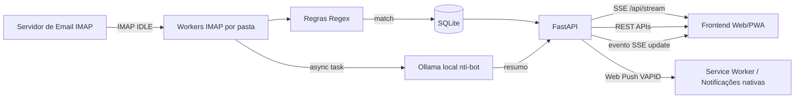

# Contexto Completo da Aplicação (para NotebookLM)

## 1. Resumo Executivo
Este projeto implementa um middleware de notificações em tempo real para e-mails institucionais/operacionais.

Objetivo principal:
- Monitorar caixas IMAP em tempo real via IDLE (sem polling).
- Filtrar mensagens por regras de negócio (remetente/assunto).
- Persistir notificações em banco local.
- Entregar alertas para interface web via SSE.
- Enriquecer notificações com resumo por IA local (Ollama).
- Reproduzir áudio (ping + TTS) no cliente.
- Enviar push nativo para dispositivos cadastrados.

Público típico:
- NOC/NTI/Suporte, equipes que precisam de alerta imediato para eventos de monitoramento e sistemas internos.

## 2. Escopo e Aplicações Práticas
Aplicações diretas da solução:
- Central de alertas de monitoramento (ex.: Zabbix/Grafana).
- Triagem de chamados (ex.: SUAP) e sistemas administrativos.
- Painel operacional para equipes de atendimento técnico.
- Notificações PWA com comportamento próximo de app nativo (push, service worker, histórico).

Benefícios operacionais:
- Redução de latência entre chegada do e-mail e ação da equipe.
- Menos dependência de consulta manual de caixa de entrada.
- Priorização visual por regra/categoria.
- Melhoria de compreensão rápida com resumo automático por IA.

## 3. Arquitetura Funcional

## 4. Componentes do Código-Base
### Backend Python
- `notification_app/app/main.py`
- `notification_app/app/mail_worker.py`
- `notification_app/app/database.py`
- `notification_app/app/models.py`
- `notification_app/app/schemas.py`
- `notification_app/run.py`

Responsabilidades:
- `main.py`: App FastAPI, lifecycle, SSE fan-out, rotas REST, TTS, health check, push subscription APIs.
- `mail_worker.py`: IMAP IDLE, parsing de e-mail, filtro de regras, persistência, chamada ao Ollama, disparo de push.
- `database.py`: engine assíncrono SQLAlchemy + inicialização do banco SQLite.
- `models.py`: entidades `Notification` e `PushSubscription`.
- `schemas.py`: modelos Pydantic para entrada/saída.
- `run.py`: bootstrap do Uvicorn.

### Frontend/PWA
- `notification_app/static/index.html`
- `notification_app/static/script.js`
- `notification_app/static/sw.js`
- `notification_app/static/manifest.json`

Responsabilidades:
- SSE client (evento `notification` e `update`).
- Render de cards/toasts, estado de conexão, histórico em bottom sheet.
- Áudio local: ping + reprodução TTS via endpoint backend.
- Fluxo de permissão push e registro de subscription.
- Service Worker com cache shell + handler de push/notification click.

### Infra/Operação
- `notification_app/nginx/notifica.conf`
- `notification_app/ecosystem.config.js`
- `notification_app/scripts/watchdog.sh`

Responsabilidades:
- Nginx como reverse proxy HTTPS + tuning para SSE/TTS/PWA.
- PM2 para supervisão de processo Python.
- Watchdog periódico para validar `/api/health` e reiniciar em falha.

## 5. Fluxo de Funcionamento (fim a fim)
1. Worker conecta no IMAP com SSL e seleciona as pastas configuradas.
2. Worker entra em IDLE e aguarda eventos do servidor de e-mail.
3. Ao detectar atividade, busca mensagens UNSEEN novas.
4. Faz parse de assunto/remetente/corpo (inclui limpeza de HTML).
5. Aplica regras de filtro.
6. Se casou regra: salva notificação no SQLite.
7. Publica evento SSE `notification` para todos os clientes conectados.
8. Dispara processamento assíncrono de IA (Ollama) para gerar resumo.
9. Publica SSE `update` com resumo da IA para atualizar card existente.
10. Envia push nativo com resumo final para subscriptions registradas.
11. Frontend executa ping imediato e TTS conforme fluxo configurado.

## 6. Regras de Filtragem Implementadas
Regras ativas no worker:
- `Zabbix NTI CJ`: casa por remetente configurado (`ZABBIX_SENDER`).
- `Sistema Processos`: casa por remetente configurado (`SISTEMA_PROCESSOS_SENDER`).
- `SUAP`: casa por remetente (`SUAP_SENDER`) + assunto contendo `novo chamado`.
- `Monitoramento`: fallback por assunto com regex `(monitor|incidente|critical|warning)`.

Observações:
- Regras usam regex case-insensitive.
- Endereços são tratados com `re.escape` para evitar falso match por caracteres especiais.

## 7. APIs Expostas pelo Backend
Principais endpoints:
- `GET /` -> entrega da página principal.
- `GET /api/stream` -> SSE em tempo real (`notification`, `update`, `ping`).
- `GET /api/notifications` -> últimas notificações (limite configurável).
- `GET /api/notifications/history` -> histórico (cap em 200 itens).
- `GET /api/health` -> health do worker IMAP (200/503 conforme pulso).
- `GET /api/tts?text=...` -> stream de áudio TTS (Edge TTS).
- `POST /api/test-notification` -> gera notificação de teste e dispara fluxo IA.
- `GET /api/vapid-public-key` -> chave pública VAPID para push.
- `POST /api/subscribe` -> cria/atualiza subscription de push.
- `DELETE /api/subscribe` -> remove subscription.
- `POST /api/push-test` -> push de teste para subscriptions ativas.

## 8. Persistência e Modelo de Dados
Banco:
- SQLite local em `notification_app/notifications.db`.

Tabelas:
- `notifications`
  - `id`, `title`, `message`, `sender`, `link`, `timestamp`, `rule_matched`
- `push_subscriptions`
  - `id`, `endpoint` (único), `keys_p256dh`, `keys_auth`, `user_agent`, `created_at`

Acesso:
- SQLAlchemy 2 async + `aiosqlite`.

## 9. Ferramentas e Tecnologias Utilizadas
Backend:
- FastAPI, Uvicorn
- SQLAlchemy async, aiosqlite
- IMAPClient
- sse-starlette
- BeautifulSoup4
- aiohttp
- edge-tts
- pywebpush, py-vapid
- Pydantic + pydantic-settings

Frontend:
- HTML/CSS/JavaScript vanilla
- Tailwind via CDN
- Service Worker + Web Push API

Operação:
- Nginx (TLS + proxy reverso)
- PM2 (process manager)
- watchdog shell script (health automation)

Dependências observadas:
- Python em `notification_app/requirements.txt`
- Node (`axios`) em `notification_app/package.json` (uso não central no runtime principal)

## 10. Como a Aplicação é Exposta na Internet
Camada de exposição:
- Nginx termina TLS em `:443` e redireciona `:80` para HTTPS.
- Backend FastAPI fica interno em `127.0.0.1:8000`.
- Nginx faz proxy das rotas `/` e `/api/*` para o backend.

Detalhes importantes de publicação:
- `location /api/stream` com `proxy_buffering off` e `X-Accel-Buffering no` para SSE em tempo real.
- Timeouts longos em SSE (24h).
- `location /api/tts` com buffering desativado para stream de áudio.
- `sw.js` servido na raiz para permitir escopo global do service worker.
- Assets estáticos em `/static/` com cache agressivo (immutable).

Configuração atual do host:
- `server_name _` (catch-all), sem domínio explícito no arquivo de Nginx.
- Certificado e chave configurados por caminho local em `/etc/nginx/ssl/...`.

## 11. Execução e Operação
Execução local:
- Ativar venv e rodar `python run.py` dentro de `notification_app`.

Produção:
- PM2 inicia `run.py` com interpretador Python da venv.
- Logs da app via PM2 em `/var/log/pm2`.
- Health check externo/interno via `/api/health`.
- `scripts/watchdog.sh` pode ser agendado (cron) para auto-recuperação.

## 12. Configuração por Variáveis de Ambiente
Arquivo de referência:
- `notification_app/.env.example`

Principais variáveis:
- IMAP: `IMAP_HOST`, `IMAP_PORT`, `IMAP_USER`, `IMAP_PASSWORD`, `IMAP_FOLDERS`
- Regras: `ZABBIX_SENDER`, `SISTEMA_PROCESSOS_SENDER`, `SUAP_SENDER`
- App: `APP_HOST`, `APP_PORT`
- Worker: `IMAP_RECONNECT_DELAY`, `IMAP_IDLE_TIMEOUT`
- Push: `VAPID_PUBLIC_KEY`, `VAPID_PRIVATE_KEY_PATH`, `VAPID_MAILTO`

Importante para compartilhamento externo:
- Não compartilhar `.env` real, `vapid_private.pem`, tokens/senhas/chaves.
- Para documentação, usar apenas `.env.example` com valores fictícios.

## 13. Segurança e Riscos Relevantes
- Credenciais IMAP e chave privada VAPID são sensíveis.
- Push subscriptions armazenam endpoint/chaves de dispositivo.
- SSE mantém conexão longa; depende de tuning correto no proxy.
- Banco SQLite local simplifica deploy, mas limita cenários de escalabilidade horizontal.
- `run.py` usa `reload=True`; em produção geralmente recomenda-se `reload=False`.

## 14. Escalabilidade e Limitações Atuais
Pontos fortes:
- Baixa latência via IMAP IDLE + SSE.
- Design assíncrono no backend.
- Fan-out simples para múltiplos clientes conectados.

Limitações:
- Estado em memória (`asyncio.Queue`, clientes SSE) não compartilhado entre múltiplas instâncias.
- SQLite local dificulta scale-out.
- Processo único no PM2 (`instances: 1`) favorece consistência do estado local.

## 15. Inventário de Arquivos Relevantes
- `README.md`
- `notification_app/.env.example`
- `notification_app/app/main.py`
- `notification_app/app/mail_worker.py`
- `notification_app/app/database.py`
- `notification_app/app/models.py`
- `notification_app/app/schemas.py`
- `notification_app/run.py`
- `notification_app/nginx/notifica.conf`
- `notification_app/ecosystem.config.js`
- `notification_app/scripts/watchdog.sh`
- `notification_app/static/index.html`
- `notification_app/static/script.js`
- `notification_app/static/sw.js`
- `notification_app/static/manifest.json`

## 16. Resumo para Consumo do NotebookLM
Este projeto é uma central de notificações operacionais em tempo real baseada em e-mail IMAP IDLE, com backend FastAPI assíncrono, frontend web/PWA com SSE e push nativo, persistência em SQLite e enriquecimento de conteúdo por IA local (Ollama). Em produção, ele é publicado por Nginx HTTPS como reverse proxy do backend interno, gerenciado por PM2 e monitorado por watchdog de saúde.

Se o NotebookLM precisar evoluir o sistema, os focos de engenharia mais naturais são:
- desacoplamento de filas/eventos para multi-instância,
- troca de SQLite por banco centralizado,
- hardening de segredos/configuração e pipeline de deploy,
- observabilidade (métricas, tracing e alertas de runtime).
